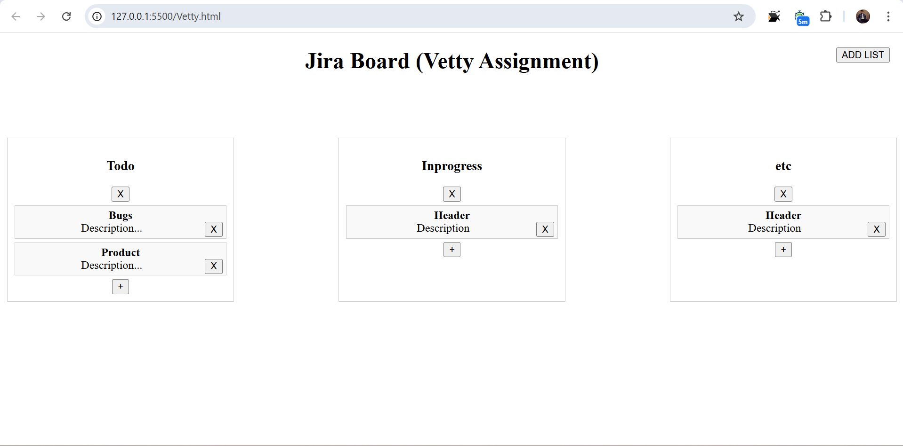

# Jira-like Board

This is a simple **Jira-like board** built with **JavaScript** for managing tasks. You can add lists, create tasks within those lists, and delete tasks or lists. The data is persistently stored in **localStorage**, so it remains available even after refreshing the page.

## Features

- **Add Lists:** Create new lists on your board.
- **Add Cards:** Add tasks (cards) within the lists with a header and description.
- **Delete Cards:** Remove individual tasks from a list.
- **Delete Lists:** Remove an entire list from the board.
- **Persistence:** Board data is saved in the browser's **localStorage** for persistence between sessions.

## Setup Instructions

### Prerequisites

- **Web browser** (e.g., Google Chrome, Firefox, Edge, Safari)
- **Text editor/IDE** (e.g., Visual Studio Code)
- **Basic knowledge of HTML, CSS, and JavaScript**.

### Steps to Run Locally

1. **Clone the repository (or create your own files):**

   You can clone this project from the repository 

   ```bash
   git clone <your-repository-url>


## Preview

Here is a preview of what the board will look like when rendered in your browser:


